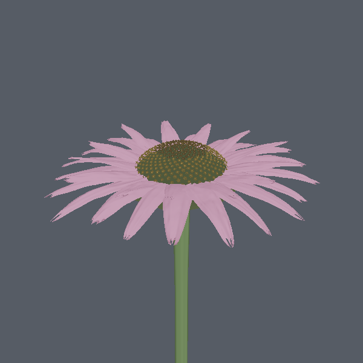
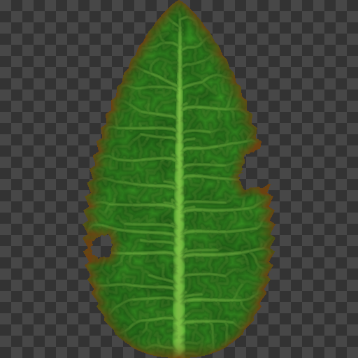

# mebee

A WebGPU macro-scale flower, built to test one claim: that photographic realism
at insect scale comes mostly from **simulating the camera and the light**, not
from modelling more geometry.

Everything is procedural. There are no art assets — no meshes, no textures, no
scans. The flower is grown from botanical rules at load time.



About 109k triangles: 18k for the plant, 91k across 420 instanced disc florets.
Both previews above are from the offline software rasteriser in `tools/`,
not from the WebGPU path (see Verification).



## Run it

Plain static files, no build step. Serve the directory over HTTP (WebGPU needs
a secure context, and `localhost` counts):

```sh
npx http-server . -p 8080     # or: python3 -m http.server 8080
```

Then open <http://localhost:8080/>. Needs Chrome/Edge 113+, Safari 26+, or
Firefox with WebGPU enabled.

Drag to orbit, wheel or pinch to zoom. The panel exposes the shader variables
that drive the scene: sun elevation, wind, petal unfurl, the floret maturation
front, aperture, focal length, and the grade.

## What it does

**The camera is the realism budget.** At a bee's working distance a 55mm lens
at f/4 has a depth of field a few millimetres deep, so nearly the whole frame is
out of focus. That means detail only ever has to exist within ~30cm of the
subject — everything beyond dissolves into bokeh. `dof.wgsl` does
scatter-as-gather bokeh with cat's-eye optical vignetting off-axis and
spherical-aberration rim brightening, because that is what fast glass does.
`post.wgsl` adds transverse chromatic aberration that grows with the square of
field height, cos⁴ natural vignetting, shadow-weighted grain, ACES and a dither
that keeps the sky from banding.

**One sun, one sky, no fill lights.** `sky.wgsl` is a single-scattering
Rayleigh/Mie atmosphere, so it reddens correctly at low sun angles for free.
Its irradiance is projected into spherical harmonics on the CPU
(`src/render/sky.js`), which is what keeps shadows filled with blue skylight
instead of crushing to black. The sun is rendered at its true angular size, and
shadows are contact-hardening — penumbra width comes from that same angular
radius, so a shadow softens with distance from its occluder.

**Plants are thin backlit membranes.** `plant.wgsl` does two-sided transmission
with per-channel absorption, so light crossing a pink petal emerges deeper red.
The leaf's transmission is modulated by its own venation, which makes veins read
as dark ribs against a glowing lamina. Cuticle specular is anisotropic along the
vein grain.

**Botany, not sculpting.** Leaf venation is grown by space colonisation
(Runions et al. 2005) with an explicitly seeded midrib and three growth stages —
secondaries, tertiaries, then a fine reticulum — closed into real polygonal
areoles. Vein widths follow Murray's law. Disc florets sit on a Vogel spiral at
the golden angle, which is why the capitulum shows interlocking Fibonacci
parastichies. Leaves carry chew holes and necrotic margins, because undamaged
plants read as CG.

**Wind is a field, not per-object noise.** `wind.wgsl` puts travelling gust
wavefronts across the world, so a gust visibly crosses the scene and everything
it passes leans in turn. The stem is a Verlet chain solved in compute.

**There is no collision system.** The same compute pass that solves the stem
publishes a `LandingSite` buffer — position, normal, radius, velocity, nectar.
Landing is a lookup in that small database, so it can never drift out of sync
with the geometry that sways, and nothing ever tests a triangle. Petals, pollen
and litter have no collision at all.

## Layout

```
index.html            app shell and the control panel
src/geom/             procedural geometry: venation, phyllotaxis, meshes
src/render/           camera optics, atmosphere, pass graph
src/gpu/              device setup, shader loader, mip generation
src/shaders/          WGSL (//!include for shared code)
tools/                offline verification (see below)
```

## Verification

This was developed in a container with no GPU, so the runtime has **never been
executed**. Compensating for that, the parts that could be checked offline were:

- `tools/check-shaders.mjs` — parses all 13 WGSL files (syntax only, not types).
- `tools/check-bindings.mjs` — cross-checks every `@group`/`@binding` in the
  shaders against the bind group layouts in `renderer.js`.
- The `Globals` uniform offsets in `renderer.js` are cross-checked field by
  field against the WGSL struct.
- `tools/preview-leaf.mjs`, `preview-flower.mjs`, `preview-sky.mjs` render the
  venation, the flower geometry and the atmosphere to PNG via a small software
  rasteriser, so the procedural output was checked by eye.
- The projection/depth-reconstruction round trip is unit-checked.
- A headless-browser smoke test confirms every module loads, all shader
  `//!include`s resolve, and the no-WebGPU path fails gracefully.

**What that does not cover:** nothing has been through a real driver. Expect to
fix pipeline validation errors, and expect the lighting constants
(`sunIntensity`, exposure, material response) to need a tuning pass against an
actual image.

## Known gaps

- Disc florets are skipped in the shadow pass.
- The leaf bake costs ~0.5s on the main thread at startup; it belongs in a worker.
- No TAA, so petal margins and pollen will alias under motion.
- Single flower, no ground plane, no bee. The landing-site plumbing is in place
  for flight, but the flight model itself is not written.
