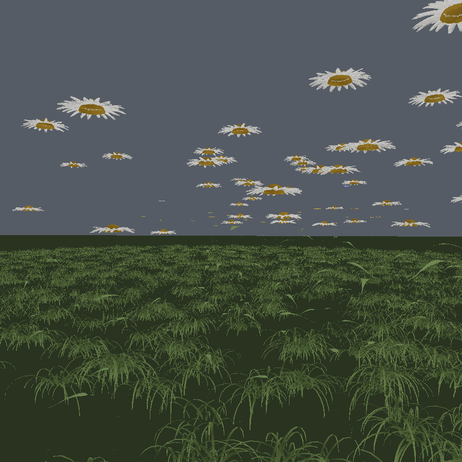
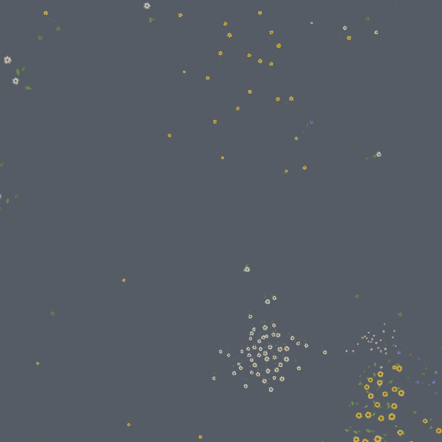

# mebee

**Live: <https://jeffbaumes.github.io/mebee/>** (needs a WebGPU browser and a real GPU)

A WebGPU macro-scale meadow, built to test one claim: that photographic realism
at insect scale comes mostly from **simulating the camera and the light**, not
from modelling more geometry.

Everything is procedural. There are no art assets — no meshes, no textures, no
scans. Six species of composite and a clover are grown from botanical rules at
load time, and several hundred plants are sown across a seven-metre field by
an ecological sampler.



The field is drifts, not a shuffle: each species has a niche on a smooth
habitat gradient and a dispersal kernel, so the same taxa turn up together and
there is bare ground between them. Looking straight down (grass off, so the
layout is visible):




Both previews are from the offline software rasteriser in `tools/`, not from
the WebGPU path (see Verification) — flat-shaded, no lens, no atmosphere. What
they are for is layout and silhouette: whether the drifts read as drifts and
whether the sward lies down the way it is meant to.

## The idea: blur is the level-of-detail metric

The usual LOD metric is projected size in pixels. That is the wrong metric
here, and by a wide margin. At a bee's working distance a 55mm lens at f/4 has
a depth of field a few millimetres deep, so a flower half a metre away is
already smeared across a 45-pixel circle of confusion. It may still cover two
hundred pixels — projected size says "draw it in full" — but nothing finer
than that circle survives to the screen. Every triangle spent resolving a petal
margin is thrown away by `dof.wgsl` a few passes later.

So `render/lod.js` measures how many features the image can still **resolve**:

```
detail = projected diameter in pixels / (1 + circle of confusion)
```

Held at one distance, with the projected size therefore identical in every row,
`npm run check:lod` prints:

```
         f/16    coc   4.1px  -> tier 0     full mesh + 380 disc florets
         f/11    coc   5.9px  -> tier 1     half-resolution index buffer
         f/8     coc   8.2px  -> tier 1
         f/5.6   coc  11.7px  -> tier 1
         f/4     coc  16.3px  -> tier 1
         f/2.8   coc  23.3px  -> tier 2     quarter-resolution, one ray whorl
         f/2     coc  32.7px  -> tier 2
         f/1.4   coc  46.7px  -> tier 2
```

Stopping down sharpens the image and pulls geometry back in; opening up throws
the meadow into bokeh and lets almost all of it collapse. Past tier 2 a plant
becomes two triangles — an oriented ellipse (a capitulum is a flat disc, so it
foreshortens; a billboard would have every flower in the meadow facing you)
tinted from its own pigments, which is what the ask "flower tops as blurry
blobs even from far away" actually needs. It writes real depth, so the defocus
pass gives it exactly the bokeh the geometry it replaced would have got, and
below a pixel across it is widened to stay rasterisable and dimmed by the area
it gained, so total flux is preserved and the far field does not crawl.

The same number reaches the shaders as `sharp`, so procedural surface detail —
petal ribs, pollen sparkle, leaf necrosis, the parastichy pattern on the disc —
fades out on exactly the schedule the geometry coarsens on. Grass thins by the
same rule: a blade is about as wide as a flower stem is thick, and once the
circle of confusion at its distance is several times that it is dropped and the
ground shader's sward texture carries it.

The middle of a capitulum is drawn three different ways — several hundred
instanced florets at the finest tier, the same golden-angle lattice painted on
the receptacle at the coarser ones, two triangles past that — so it goes
through one shared `discAlbedo()` in `instance.wgsl`. It used to be written out
three times, with three different greens and three different radial profiles,
which looked exactly like what it was: a hard green disc dropped into the
middle of every flower, changing size whenever a plant crossed a threshold.

Two things keep it bounded rather than merely clever. Per-tier budgets
(`5 / 24 / 150 / 900`) mean the frame cost does not depend on where the camera
points — a plant that misses its tier is demoted, never dropped. And the three
mesh levels are **index-only**: they stitch every 2nd or 4th row and column of
the same vertices, so switching tier costs an index-buffer swap, moves nothing
on screen, and needs no extra memory. Across all seven species that is 62k
vertices and 107k / 27k / 4.6k triangles at the three levels.

Turn on **View → LOD tier** in the panel to see the tiers colour-coded, and
**Detail bias** to watch the whole field coarsen and refine.

## The field

`geom/field.js` samples three structures at once, because that is what the eye
is reading in a real meadow:

- a **habitat** gradient — moisture, exposure, grazing pressure — which varies
  smoothly over metres and decides what *can* grow where. It is baked to a
  texture the ground and grass shaders also read, so the damp hollow is greener
  *and* has the mayweed in it, and the grazed patch is browner *and* has the
  daisies, without either being placed by hand;
- **dispersal**: a Thomas cluster process, parents drawn against each species'
  own suitability and offspring scattered by a kernel whose width is how that
  species travels — a clonal daisy makes a tight sheet, a wind-blown annual a
  loose drift;
- **competition**: dart-throwing against a spatial hash, with conspecifics
  excluding each other harder than strangers, so a patch is evenly spaced
  inside while two species still interleave at an edge.

`npm run check:field` measures the result against null models rather than
asserting it: species are ~30% aggregated against a label shuffle that holds
density and abundance fixed, 78% of plants sit on ground that suits their own
species better than a random point does, and the best ground carries the
biggest plants.

## The flowers

`geom/species.js` is a morphospace, not a palette. Colour is **not** a free
parameter: a ray floret's albedo is built the way a real one is, as a white,
air-filled scattering ground minus what its pigments absorb.

```
carotenoid  [0.03, 0.30, 1.55]   eats blue, leaves yellow
anthocyanin [0.10, 1.30, 0.35]   eats green, leaves magenta
cyanic      [1.15, 0.80, 0.06]   metal-complexed, eats red — why blue is rare
```

Vary the loading and you get the range a species shows; vary it a lot and you
get a different species. You cannot get a colour no flower has, which is the
constraint that makes a field of them read as a field rather than a colour
picker. Transmission takes a longer path through the same pigment, so a backlit
pink petal glows deeper red than it looks in reflection — the same load, a
different exponent.

Six composites, chosen to span the morphospace rather than to be pretty: ox-eye
daisy, scentless mayweed, corn marigold, common cat's-ear (ligulate — three
whorls of strap florets and almost no disc), common daisy (78mm, crimson-tipped
rays, and it wins exactly where the sward is grazed short), and cornflower
(thirteen flared, deeply cut trumpets in violet-blue). Ray counts are Fibonacci
and held constant within a species, because they sit on the same phyllotactic
lattice as the disc; what varies between individuals is vigour, phenology and
pigment loading, which is why two plants in one patch look like siblings.

Wind response is per plant and derived rather than dialled: a stem is a
cantilever, so `stemWindGain()` scales the wind force by the height-to-radius
ratio. A common daisy nods 2.5–7mm; a cornflower whips 12–33mm.
`tools/sim-stem.mjs` sweeps every stem the field actually grows and reports the
sway and the lurch of each.

## Deploy

A GitHub Actions workflow (`.github/workflows/pages.yml`) builds and publishes
the site on every push to `main`.

**It needs Pages switched on first, which has to be done by hand once.** The
workflow's own `GITHUB_TOKEN` is not permitted to create a Pages site, so
`configure-pages` cannot bootstrap it (`Create Pages site failed: Resource not
accessible by integration`), and the API path is likewise off limits to most
integration tokens.

1. **Settings -> Pages -> Build and deployment -> Source -> "GitHub Actions"**
   (<https://github.com/jeffbaumes/mebee/settings/pages>)
2. Re-run the workflow, or push anything to `main`.

That has been done for this repository, so pushes to `main` now publish on
their own.

The repository also has to be public, unless the account is on a paid plan --
GitHub Pages is not available for private repositories on GitHub Free.

The site then lands at <https://jeffbaumes.github.io/mebee/>. The shader loader
resolves paths against its own module URL, so the project subpath works.

## Run it

Plain static files, no build step. Serve the directory over HTTP (WebGPU needs
a secure context, and `localhost` counts):

```sh
npx http-server . -p 8080     # or: python3 -m http.server 8080
```

Then open <http://localhost:8080/>. Needs Chrome/Edge 113+, Safari 26+, or
Firefox with WebGPU enabled. HTTPS or `localhost` is required either way —
WebGPU only exists in a secure context.

You start as the bee. The gear button in the upper right opens a panel that
exposes the shader variables that drive the scene: sun elevation, wind, petal
unfurl, aperture, focal length, the detail bias and the grade. **Hold 60 fps**
(on by default) moves the render scale to keep the frame inside the refresh
interval; dragging the render-scale slider takes over by hand. The same panel
has a **Show debug text** checkbox (off by default) for the fps/lod readout,
which otherwise sits in the upper right next to the gear. The `gpu` line in
that readout is the device's own per-pass timing, where the browser exposes
timestamp queries.

**The camera says where to go; the keys decide whether to go there.** Click to
capture the mouse; moving it orbits the camera around the bee and does nothing
else. **A/D** swing that same orbit from the keyboard. Whichever way the camera
faces is the heading being *asked for* — **W** is what answers it: hold it and
the bee arcs onto that heading at its own turn rate and drives along it, so a
change of aim is a curve with a real radius (about 330mm at cruise) rather than
a pivot on the spot. **S** is the same thing with the sign flipped — the nose
still comes round onto the aim and the bee backs off along it, which is how a
real bee reverses and what makes S a brake in practice without being written as
one. **Space** or the **LIFT** button goes straight up. Land on a flower and
WASD walks it: W/S forward and back, A/D turn, space to take off again.

The gating is what keeps the two halves apart: it is W that turns the bee, not
the camera. Swing the orbit all the way round with nothing held and the bee
carries on exactly as it was, seen from a new angle — so you can look at a
flower without flying at it, which the previous model (thrust straight along the
view) made impossible. And nothing ever swings the orbit *back*: there is no
recentring term at all, because W flying away from the camera lines the bee up
under it from the other end, without the camera ever being taken off the player.

It is an elytra rather than a hovercraft — gravity is always on and the wing
only carries its own weight once there is speed over it, in either direction,
because airspeed has no sign. So the descent is simply letting go: no thrust, no
speed, no lift, and what is left is an 85mm/s settle. The landing is line the
bee up over a head with W, then release and let it come down.

The one cue that makes that possible is a second, fictitious shadow cast
straight *down* from the bee — a soft blot that spreads with the drop and a hard
ring at a fixed 14mm radius, evaluated analytically by every surface that shades
itself, so it falls correctly on turf, on a grass blade and on the flower head
being landed on. The sun's own shadow is no help: it lies wherever the sun puts
it, most of a metre downwind at nine in the morning.

If the browser will not grant the pointer capture — anything embedded in a frame
that is not permitted to — it falls back to drag-to-orbit and says so. On a
phone the thumbstick is the WASD block (across aims, along goes and stops), the
LIFT button is the space bar, and a second finger anywhere else orbits.

## What it does

**The camera is the realism budget.** At a bee's working distance a 55mm lens
at f/4 has a depth of field a few millimetres deep, so nearly the whole frame is
out of focus. That means detail only ever has to exist within ~30cm of the
subject — everything beyond dissolves into bokeh, and (see above) the geometry
budget follows it down. `dof.wgsl` does scatter-as-gather bokeh with cat's-eye
optical vignetting off-axis and spherical-aberration rim brightening, because
that is what fast glass does. `post.wgsl` adds transverse chromatic aberration
that grows with the square of field height, cos⁴ natural vignetting,
shadow-weighted grain, ACES and a dither that keeps the sky from banding.

**One sun, one sky, no fill lights.** `sky.wgsl` is a single-scattering
Rayleigh/Mie atmosphere, so it reddens correctly at low sun angles for free.
Its irradiance is projected into spherical harmonics on the CPU
(`src/render/sky.js`), which is what keeps shadows filled with blue skylight
instead of crushing to black. The sun is rendered at its true angular size, and
shadows are contact-hardening — penumbra width comes from that same angular
radius, so a shadow softens with distance from its occluder. The same CPU
atmosphere precomputes the two horizon colours the aerial term blends between;
evaluating it per fragment would cost more than the rest of the frame.

**Plants are thin backlit membranes.** `plant.wgsl` does two-sided transmission
with per-channel absorption, so light crossing a pink petal emerges deeper red.
The leaf's transmission is modulated by its own venation, which makes veins read
as dark ribs against a glowing lamina. Cuticle specular is anisotropic along the
vein grain.

**Botany, not sculpting.** Leaf venation is grown by space colonisation
(Runions et al. 2005) with an explicitly seeded midrib and three growth stages —
secondaries, tertiaries, then a fine reticulum — closed into real polygonal
areoles. Vein widths follow Murray's law. Disc florets sit on a Vogel spiral at
the golden angle, which is why the capitulum shows interlocking Fibonacci
parastichies — and why, one tier coarser, the *same* lattice can be drawn as
the interference of its two dominant parastichy families instead of as several
hundred instances. Leaves carry chew holes and necrotic margins, because
undamaged plants read as CG.

**Wind is a field, not per-object noise.** `wind.wgsl` puts travelling gust
wavefronts across the world, so a gust visibly crosses the meadow and every
plant it passes leans in turn. The stems are Verlet chains solved in one
compute dispatch — a workgroup per plant, packed back to back in one buffer, so
a plant index is a stride and there is no per-plant state on the CPU at all.

**The bee is a glider, and the camera is not attached to it.** Flight used to be
two axes of throttle plus an automatic camera: the stick set a ground speed, a
button set a climb rate, and the pitch of the view was *derived* — partly from
the climb rate, partly from wherever the nearest flower happened to be. Aiming
was therefore something that happened to you, and the one manoeuvre this scene
is about — pick a flower out of the meadow and go to it — was the one manoeuvre
the controls could not express.

Now `sim/flight.js` holds three independent things: an orbit, written by the
pointer and by A/D; a heading, which only W turns; and a velocity, integrated
from thrust, gravity and drag. The orbit is a *request* and the heading is what
the bee makes of it, at a bounded rate — that intermediate step is the whole
difference between flying and dragging an icon around, and it is why the aim can
be swung freely without the bee following it anywhere. An earlier version ran
the thrust straight along the view with no rate between the two, so every glance
was a course change. `check-flight.mjs` asserts it from both sides: a 180° orbit
with nothing held leaves the heading bit-identical, holding W then brings the
bee round to meet it, the turn never exceeds its rate on the way, and no state
of the bee — climbing, cruising, braking, walking, turning — moves the orbit by
a single bit.

The camera rig runs along the *orbit*, and the bee's body along its *own*
heading, so a bee crossing your view is seen from the side rather than
moonwalking. The rig is also aimed below the bee rather than along it, which is
what puts the ground being landed on inside the frame at all. Crawling, the
rig's up is the petal's normal rather than the sky, so it holds while the bee
walks round the side of a head. `geom/bee.js` is the one thing in this project
that is not botany.

**There is no collision system.** The same compute pass that solves the stems
publishes a `LandingSite` per plant — position, normal, radius, velocity,
nectar. The whole table is read back every frame (a few tens of kilobytes), so
"which flower am I inside" is a linear scan of contiguous floats and landing is
a lookup in a small database that can never drift out of sync with the geometry
that sways. Nothing ever tests a triangle. Petals, pollen and litter have no
collision at all.

**Ground cover has no instance buffer.** A field seven metres across needs tens
of millions of blades, almost all of them behind the camera or inside the
bokeh. So `grass.wgsl` hashes each blade out of a fixed world grid inside a
window that follows the camera: blades stay nailed to the world, the cost is
constant wherever the bee flies, and the field could be a hundred metres across
for the same price. Blades cluster into tufts rather than tiling evenly —
each block of cells hashes its own clump centre and a chance of carrying no
tuft at all, so the sward reads as bunches with bare ground between them.

The sward is short, prostrate turf: a blade reaches about two thirds of its own
length out across the ground and stands only about half of it up, so it lies
over the soil rather than standing in it. It is stored at unit ARC LENGTH with
the centreline and the cross-section in separate components, because the two
scale by quite different numbers — and because they used not to. A V-fold
nominally a third of a millimetre deep was baked into the centreline's own
plane, where the vertex shader's LENGTH scale caught it and made it a
centimetre: the sward read as folded ribbons, and a gust that turned one
edge-on made it disappear. The keel is now shading only, which is all it was
ever doing at a blade's real width.

**Clover is ground cover too.** White clover is a stoloniferous mat, and the
thing that reads as a clover patch is a closed sheet of trefoils lying on the
sward, not a stand of them held up on stalks. So the petiole is 11mm, the
leaflets are held almost flat, and a patch is spaced well inside one trefoil's
own reach so neighbours overlap. The leaflet is obcordate — narrow at the base,
widest about seven tenths of the way up, blunt and notched at the apex — and
carries the pale chevron that is the single most recognisable thing about the
plant. The flowering form is deliberately scarce, and its head is a globe:
`geom/flower.js` places those florets on a spherical cap rather than on the
Vogel disc every composite here uses, because a disc model draws a clover head
as a cushion with a flat bottom and a hole in it.

## Layout

```
index.html            app shell and the control panel
src/geom/             procedural geometry: species, field sampling, venation,
                      phyllotaxis, meshes, the bee
src/render/           camera optics, atmosphere, culling and LOD, pass graph
src/sim/              bee flight, and the landing-site table it queries
src/gpu/              device setup, shader loader, mip generation
src/shaders/          WGSL (//!include for shared code)
tools/                offline verification (see below)
```

## Verification

This was developed in a container with no GPU, so the runtime has **never been
executed**. Compensating for that, the parts that could be checked offline were:

- `tools/validate-shaders.mjs` — runs every shader through **naga**, the
  compiler wgpu uses: full type checking, uniformity analysis and reserved-word
  rules. This is the check that matters; run `npm install && npm run check`.
- `tools/check-shaders.mjs` — a faster parse-only pass with no native
  dependency. It does *not* catch type errors or reserved words, which is
  exactly how `var ref = ...` reached a real driver before naga was added.
- `tools/check-bindings.mjs` — cross-checks every `@group`/`@binding` in the
  shaders against the bind group layouts in `renderer.js`; every storage
  struct's size against the JS that packs it, by the *named constant* rather
  than by a number written twice; the `Globals` uniform field by field, with
  offsets recomputed from the WGSL declaration order (this is the one struct
  where a wrong offset is completely silent — every field is a `vec4f`, so a
  mis-numbered slot just feeds the shader the sun in the lens's place); and the
  two constants a shader and the renderer both have to know, the floret
  instance stride and the ground disc's tessellation.
- `tools/check-lod.mjs` — the headline claim, tested directly: hold a flower
  still, open the aperture, and the tier must coarsen even though the flower
  covers exactly as many pixels as before. Also that distance still coarsens
  it, that the CPU's circle-of-confusion twin agrees with `common.wgsl`, that
  the per-tier budgets are never exceeded, that every run of the draw list
  holds only its own tier and species (a run is consumed via `firstInstance`,
  so an overlapping one draws the wrong flower), that no plant is drawn twice,
  that impostors arrive back to front, and that a plant sitting on a threshold
  does not flip tier every frame.
- `tools/check-field.mjs` — the ecology, against null models: species
  aggregation versus a label shuffle, habitat fit versus a species-matched
  random point, vigour against habitat quality, the within-species hue spread
  against the field's, and the spacing rule. Plus determinism, and that the
  packed instance buffer is finite with unit rest axes.
- `tools/check-flight.mjs` exercises the bee: that a given stick deflection
  turns the view the same way in the air as on the flower (the crawl turn
  shipped inverted relative to the flying turn, and nothing static could have
  caught it), that pushing the stick up looks up and cannot be driven past the
  pitch cap, that boosting holds height while coasting settles and that a boost
  with the nose down actually drives the bee down (which is the whole control
  scheme, and the kind of thing a constant with the wrong sign quietly
  reverses), that the walk cannot leave the crawl dome from any heading on an
  upright or a leaning head, that landing captures a 10mm daisy and a 56mm
  ox-eye alike without snagging on one flown past, and that a long flight stays
  finite and inside the meadow.
- `tools/sim-stem.mjs` is a CPU port of the GPU stem solver -- same integrator,
  constraints, ordering and constants -- which is how the wind timing was
  settled, and now how the per-plant wind gain was: it sweeps every stem the
  field actually grows, at the shipped stepping policy and at the top of the
  wind slider, and reports each one's sway and its frame-to-frame lurch. Run it
  after touching `wind.wgsl`; the defaults are the shipped values, so a change
  there without a matching change here makes the tool lie.
- `tools/preview-flower.mjs`, `preview-leaf.mjs`, `preview-sky.mjs` render the
  geometry, the venation and the atmosphere to PNG via a small software
  rasteriser. `meadow` and `plan` draw the real field so the layout can be
  checked by eye; a species name draws one individual of it, with its own
  pigments rather than a painted-on colour. Its grass placement is a CPU twin
  of `grass.wgsl`'s hashing, constant for constant, so that a change to one
  without a change to the other makes the preview lie — the same contract
  `sim-stem.mjs` has with `wind.wgsl`. `GRASS=0` turns the sward off, `GROUND=0`
  the ground plane, `GRASS_RADIUS` sets how far the sward is laid.
- `tools/check-modules.mjs` parses every module, imports for real every one
  that does not need a GPU or a DOM, and walks the shader graph: that every
  file `renderer.js` asks the loader for exists, that every `//!include`
  resolves, and that nothing on disk is orphaned. `renderer.js` and `main.js`
  cannot be imported here -- one builds GPU resources in its constructor, the
  other boots against the DOM -- so a syntax pass is the only mechanical check
  the two largest files in the project get.
- The projection/depth-reconstruction round trip is unit-checked.

**What that does not cover:** naga is spec-conformant but is not the same
compiler Chrome ships (Tint), and no amount of static checking says whether the
image looks right. Expect the lighting constants (`sunIntensity`, exposure,
material response) to need a tuning pass against an actual render, and the LOD
thresholds and per-tier budgets to need one against an actual frame time.

## Known gaps

- Disc florets, grass and the bee are skipped in the shadow pass, and only the
  two finest tiers of plant cast at all.
- The bee's wings are the arc they beat through, stippled out with a
  screen-space hash rather than alpha blended. That is deliberate — it needs no
  sort and no second pipeline, and the defocus pass turns the stipple back into
  the blur it stands in for — but stopped right down and held still, the
  stipple is visible as a stipple.
- Nothing stops the third-person camera from ending up inside a leaf, or under
  a flower head if you look straight up while crawling on one. It is clamped
  out of the soil and no further.
- Tall flowering grasses do not exist yet. Everything `grass.wgsl` grows is
  ground sward.
- The leaf bake plus seven species of geometry costs ~1s on the main thread at
  startup; it belongs in a worker.
- No TAA, so petal margins and pollen will alias under motion — and with
  several hundred plants there is a great deal more margin than there was.
- The impostor is alpha blended with depth write, which is correct only because
  the draw list is sorted; two heads at the same distance can order wrongly.
- The habitat map is baked at 256², so its gradients are smooth to about 3cm.
